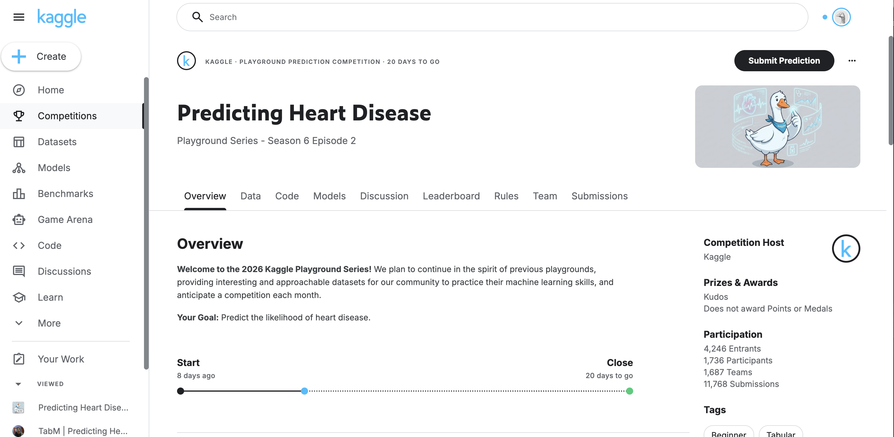
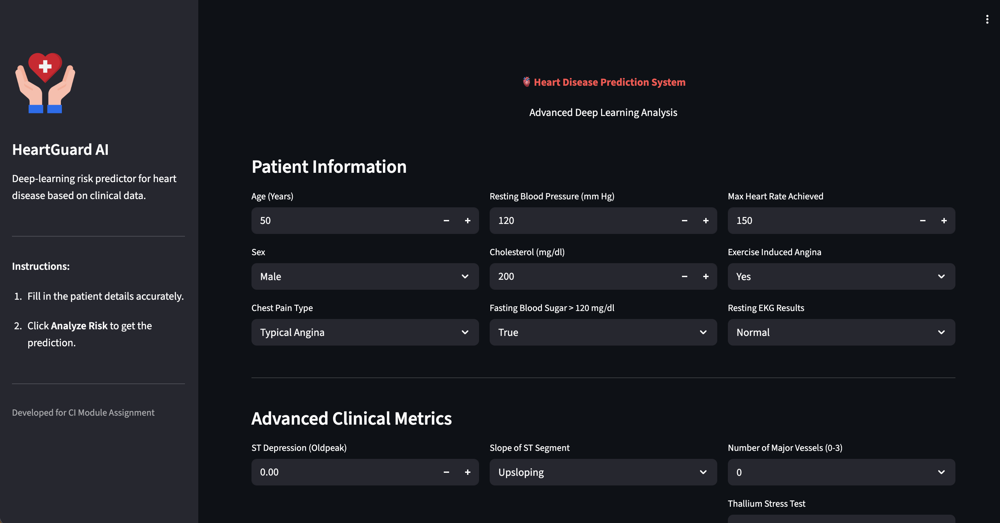
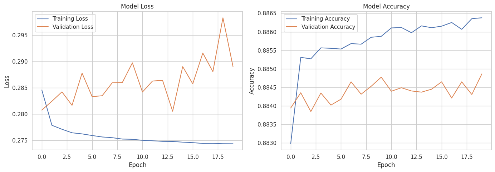

# ❤️ HeartGuard AI — Intelligent Heart Disease Prediction

[](https://colab.research.google.com/drive/1pCpwELdg-8gX6irQyQ4zYIFH-FyzirLJ?usp=sharing)


## 📌 Project Overview

**HeartGuard AI** is a cutting-edge deep learning system designed to assess the risk of heart disease based on clinical patient data. Developed as a response to the **Kaggle Playground Series (Season 6, Episode 2)**, this project demonstrates the power of neural networks in medical diagnostics.

The system processes vital health metrics—such as age, cholesterol, and chest pain type—through a custom-trained neural network to provide an instant risk assessment.


*Figure 1: AI-driven analysis for early detection.*

---

## 🚀 Key Features

-   **☁️ Cloud Native**: Optimized for Google Colab for easy replication and training.
-   **🧠 Deep Learning Core**: Powered by a TensorFlow/Keras neural network for high accuracy.
-   **📊 Interactive Dashboard**: A sleek Streamlit interface for real-time predictions.
-   **📈 Insightful Analytics**: Detailed visualization of dataset correlations and feature distributions.
-   **🔒 Privacy Focused**: Runs locally or in a secure session, ensuring patient data privacy.

---

## 🛠️ Tech Stack

-   **Language**: Python 3.8+
-   **Deep Learning**: TensorFlow, Keras
-   **Data Manipulation**: Pandas, NumPy
-   ** preprocessing**: Scikit-Learn
-   **Web Framework**: Streamlit

---

## 💻 Installation & Usage (Local)

Run HeartGuard AI on your local machine for the best experience.

### Prerequisites
-   Python 3.8 or higher
-   pip (Python package manager)

### Step 1: Clone the Repository
```bash
git clone https://github.com/lahiruharshana/HeartGuard-AI.git
cd Heart_Disease_model
```
*(Or simply download the project files if not using Git)*

### Step 2: Install Dependencies
Install the required packages using the provided `requirements.txt`:
```bash
pip install -r requirements.txt
```

### Step 3: Run the Application
Launch the HeartGuard AI dashboard:
```bash
streamlit run app.py
```
The app will open in your default browser at `http://localhost:8501`.

> **Note**: Ensure `heart_model.keras` and `scaler.pkl` are in the same directory as `app.py`. If they are missing, run the training notebook first.

---

## ☁️ Installation & Usage (Google Colab)

You can run the entire pipeline, including the web app, directly in the cloud.

1.  **Open in Colab**: Click the badge at the top of this README.
2.  **Run All Cells**: Execute the notebook to download data, train the model, and generate artifacts.
3.  **Launch App**: The notebook includes a script to run Streamlit via `localtunnel`:
    ```python
    !streamlit run app.py & npx localtunnel --port 8501
    ```
4.  **Access**: Copy the IP address printed in the output and paste it into the tunnel URL.

---

## 📸 Application Preview

### 1. Interactive Risk Assessment
Input patient data and get instant feedback with confidence scores.



### 2. Data Analysis
Explore the underlying data patterns used to train the model.



---

## 📂 Project Structure

```
Heart_Disease_model/
├── Heart_Disease_Assignment.ipynb  # 📓 Training & Analysis Notebook
├── app.py                          # 📱 Streamlit Application
├── heart_model.keras               # 🧠 Trained Neural Network
├── scaler.pkl                      # ⚖️ Feature Scaler
├── requirements.txt                # 📦 Dependencies
├── README.md                       # 📄 Documentation
└── images/                         # 🖼️ Assets
```

---

## 🤝 Contributing

Contributions are welcome!
1.  Fork the Project
2.  Create your Feature Branch (`git checkout -b feature/AmazingFeature`)
3.  Commit your Changes (`git commit -m 'Add some AmazingFeature'`)
4.  Push to the Branch (`git push origin feature/AmazingFeature`)
5.  Open a Pull Request

---

## 📜 License

Distributed under the MIT License. See `LICENSE` for more information.
